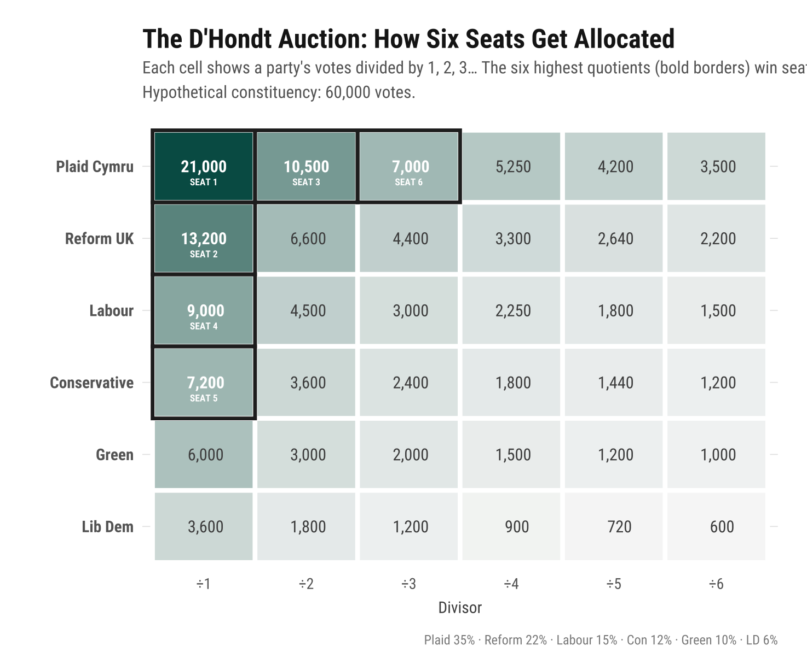
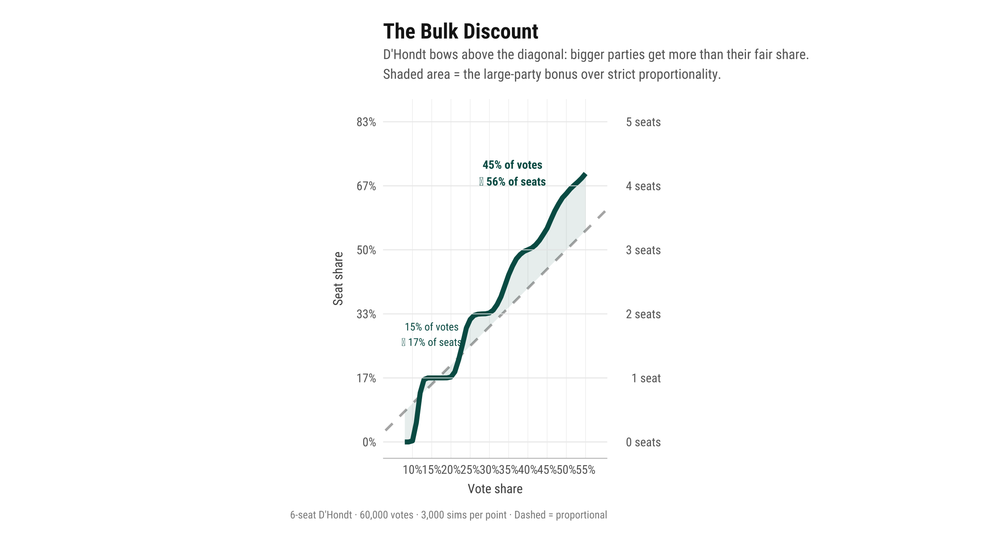
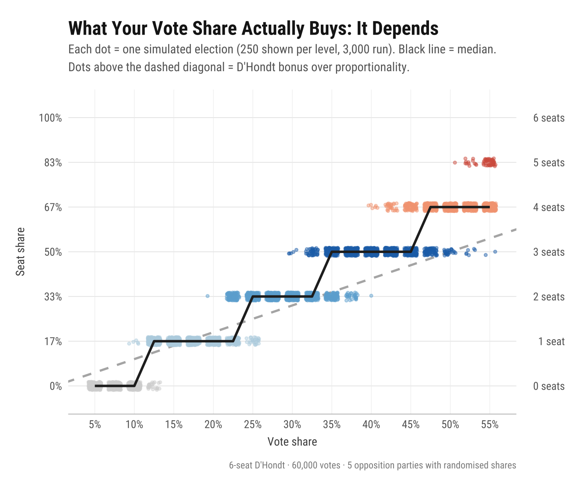

On 7 May 2026, Wales will elect its Senedd using an entirely new electoral system. The Senedd Cymru (Members and Elections) Act 2024 replaces the previous mixed-member system with closed-list proportional representation, allocating 96 members across 16 constituencies of six seats each, using the D'Hondt divisor method.

The shift to a proportional system has been widely welcomed, and for good reason. Removing the first-past-the-post element of the previous arrangement better suits the fragmented, multi-party reality of contemporary Welsh politics. But how proportional is D'Hondt in practice? In a six-seat constituency with six competitive parties — a reasonable description of what Welsh voters now face — does the method actually deliver on its proportional promise? In this post, I use simulations to show that the answer is: it depends. D'Hondt performs reasonably well under some conditions, but it consistently advantages larger parties, and the size of that advantage turns critically on how the opposition vote fragments.

## The D'Hondt mechanism

D'Hondt is a divisor method. Each party's vote total is divided by a series of integers — 1, 2, 3, 4, 5, 6 — generating a table of quotients. The six highest quotients across all parties each win a seat. The method is straightforward, but its consequences are not immediately obvious.

Consider a hypothetical constituency with 60,000 votes split across six parties: Plaid Cymru on 35%, Reform UK on 22%, Labour on 15%, the Conservatives on 12%, the Greens on 10%, and the Liberal Democrats on 6%.

*Figure 1. The D'Hondt quotient table. Each cell shows a party's votes divided by 1 through 6. The six highest quotients (bold borders) win seats. In this scenario, Plaid Cymru wins three of the six seats.*

The key feature is visible in the table: Plaid Cymru's third-highest quotient (21,000 ÷ 3 = 7,000) is still larger than the Greens' first quotient (6,000) or the Liberal Democrats' first quotient (3,600). A large party's third helping can outbid a small party's first. This is the mechanism through which D'Hondt generates disproportionality.

## The bulk discount: vote share versus seat share

To quantify the large-party advantage, I simulated elections across a range of focal-party vote shares (8% to 55%), using randomised opposition splits to generate realistic competitive environments. At each vote share, 3,000 elections were simulated with the remaining vote distributed among five opposition parties using independent Gamma draws with shape parameters α = [3.0, 2.5, 1.5, 1.2, 0.8], normalised to sum to the remaining share (see the methodology section below for full details). I then computed the average seat share the focal party receives under D'Hondt and compared it to what strict proportionality would award.

*Figure 2. The D'Hondt dividend. The teal curve shows average seat share at each vote share level, based on 3,000 simulated elections per point. The dashed diagonal represents perfectly proportional allocation. The shaded area is the large-party bonus: at 45% of the vote, a party receives roughly 56% of seats on average.*

The result is clear: the D'Hondt curve bows consistently above the proportional diagonal. A party with 15% of the vote receives approximately 17% of seats — a modest bonus. But a party with 45% of the vote receives approximately 56% of seats — an 11 percentage point premium over proportionality, equivalent to roughly two-thirds of an additional seat in a six-seat constituency. The bonus is not constant; it grows with vote share. This is the structural advantage that D'Hondt provides to large parties.

The intuition is straightforward. In a six-seat constituency, each seat is worth 16.7% of representation. Seats are indivisible, so the rounding that occurs at every allocation necessarily benefits some parties at the expense of others. D'Hondt's divisor series (1, 2, 3, 4, 5, 6) allows large parties' later quotients to remain competitive against small parties' first quotients. Under the alternative Sainte-Laguë method — which divides by 1, 3, 5, 7, 9, 11 — the penalty for seeking a second or third seat is much steeper, and the resulting allocation hews much closer to proportionality.

## Uncertainty and opposition fragmentation

Figure 2 shows averages, but individual constituency outcomes can diverge substantially from the mean. A party's seat haul depends not only on its own vote share but on how the remaining vote distributes across its competitors. To illustrate this uncertainty, Figure 3 plots individual simulated elections as a beeswarm, with each dot representing one election outcome.

*Figure 3. Individual simulated elections (250 shown per vote-share level, 3,000 run). Each dot is one election outcome. The dashed diagonal is proportional allocation; dots above the line represent a D'Hondt bonus. The black line traces the median outcome. At transition points (around 25% and 35%), outcomes split between two seat levels depending on the opposition configuration.*

The solid black line — the median outcome — deserves careful reading. Because seats are indivisible, seat share can only take the values 0%, 16.7%, 33.3%, 50%, 66.7%, 83.3%, or 100%. The median therefore moves in discrete steps: it sits flat at one level until enough simulations tip over into the next seat, then it jumps.

At low vote shares, the median is stuck at zero even where proportionality would award a fraction of a seat — this is the effective threshold that locks out small parties. The transition, however, is remarkably sharp. A party on 10% of the constituency vote wins a seat in only 2% of simulations. But at 12%, that figure jumps to 78%, and by 13% it is virtually guaranteed. The 50/50 threshold sits at around 11.5%.

From that threshold onwards, two features are notable. First, the median line consistently sits above the proportional diagonal, confirming the systematic large-party bonus. The gap grows with vote share: each successive step lands further above the diagonal than the last. Second, at transitional vote shares the beeswarm splits vertically — at around 22.5%, the split between one seat and two seats is roughly 58/42; at around 35%, the split between two and three seats is roughly 41/59. The determining factor is the opposition configuration: when the non-focal vote concentrates among one or two strong rivals, their later quotients crowd out the focal party; when the opposition fragments, the focal party's later quotients outbid the smaller parties' first quotients.

| Seats won | Seat share | 50% chance at | Near-certain at |
|-----------|------------|---------------|-----------------|
| 1 seat    | 16.7%      | ~11.5%        | ~13%            |
| 2 seats   | 33.3%      | ~23%          | ~26%            |
| 3 seats   | 50.0%      | ~34.5%        | ~39%            |
| 4 seats   | 66.7%      | ~46.5%        | ~52%            |

*Vote share at which a party has a 50% or 95% probability of winning at least N seats, based on 5,000 Monte Carlo simulations per vote-share level with Dirichlet-distributed opposition.*

## Tactical voting under D'Hondt

As the new system beds in, voters will inevitably hear appeals framed in terms of marginal seats: "The sixth seat is between us and Party X […] vote for us to stop them." This framing is misleading for two reasons.

The first problem is epistemic. As Figure 3 makes clear, constituency outcomes are highly sensitive to the precise distribution of votes across all parties. At transitional vote shares, a shift of just one or two percentage points — or a different pattern of opposition fragmentation — can move outcomes by a full seat. No party, no matter how sophisticated its internal polling, can know with confidence that the contest in a given constituency is specifically for the sixth seat. The certainty implied by such appeals is false.

The second problem is strategic, and it cuts deeper. Even if a voter accepts the premise that their preferred bloc of parties is competing for a marginal seat, the most efficient tactical response under D'Hondt is not necessarily to vote for whichever party in that bloc claims to be closest to the threshold. It is to concentrate support behind the *largest* party in that bloc.

This follows directly from the D'Hondt dividend documented above. A bloc of ideologically adjacent voters wins more total seats by consolidating behind a single large party than by splitting their support across two medium-sized ones. Two parties each polling at 20% will, on average, win fewer combined seats than a single party polling at 40%, even though the total vote share is identical.

This is counterintuitive. Under first-past-the-post, tactical voting means holding your nose and backing whoever is best placed to beat the candidate you dislike most. Under D'Hondt, tactical voting within a bloc means something quite different: rallying behind the strongest party in your preferred grouping, precisely because the system rewards concentration. The D'Hondt dividend is not just an analytical curiosity — it is a structural incentive to consolidate.

## Implications for 7 May

Three implications follow from the analysis.

**First, D'Hondt in six-seat constituencies is not particularly proportional when party support is very fragmented.** The gap between vote share and seat share is systematic, growing, and favours large parties. Its practical significance in the specific context of Wales's new system has received less attention than it warrants.

**Second, opposition fragmentation is a first-order variable.** A party's seat count depends as much on how its opponents' votes distribute as on its own performance. The real strategic question is not chasing the mythical "sixth seat" but consolidating behind the strongest party in your preferred bloc.

**Third, tactical voting under D'Hondt is very different from tactical voting under first-past-the-post — but still possible.** The structural incentive is to concentrate support behind the largest party in your ideological grouping. Claims that the contest is for a specific marginal seat should be treated with scepticism.

All electoral systems involve trade-offs between proportionality, governability, voter comprehension, and accountability. D'Hondt's large-party bonus is, from one perspective, a positive feature in that it makes single-party government more achievable and may reduce fragmentation. But the system's mechanics should be clearly understood, particularly by voters and commentators encountering it for the first time.
