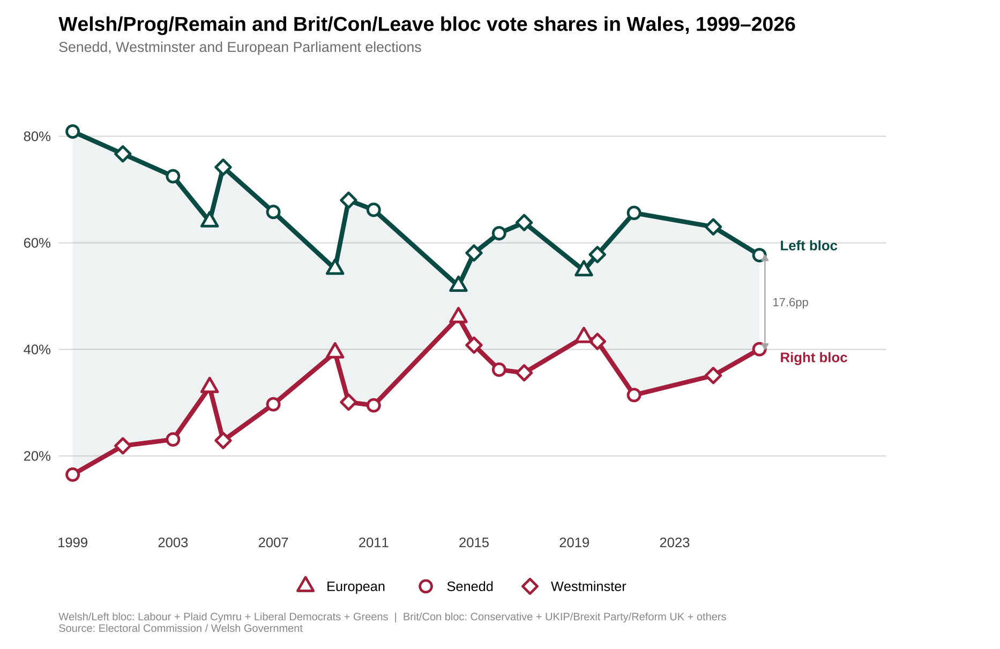
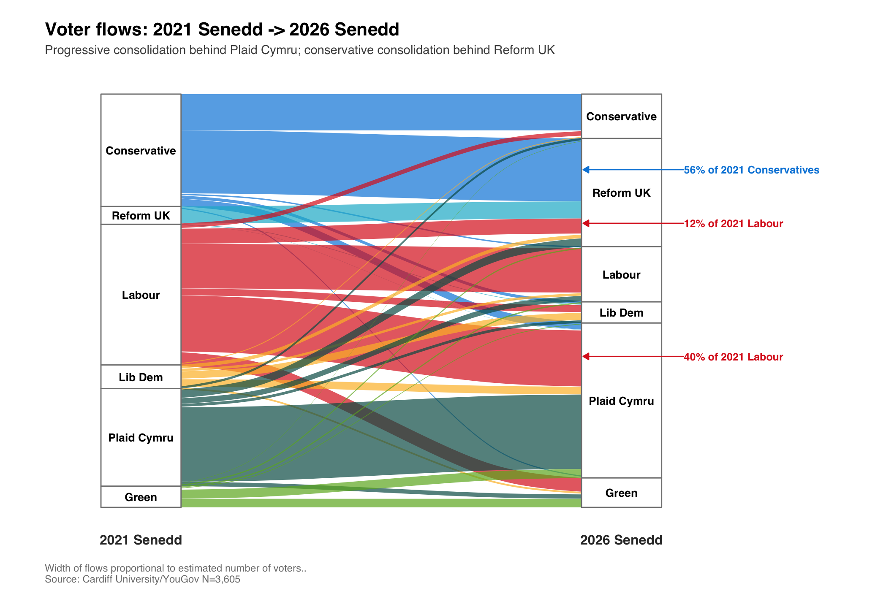
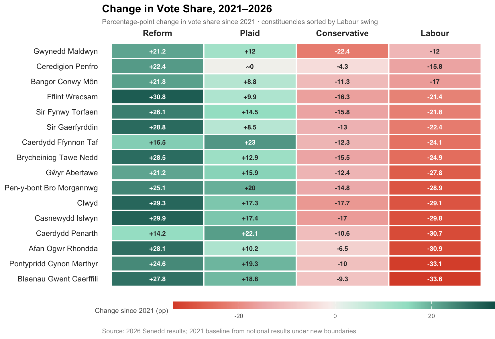
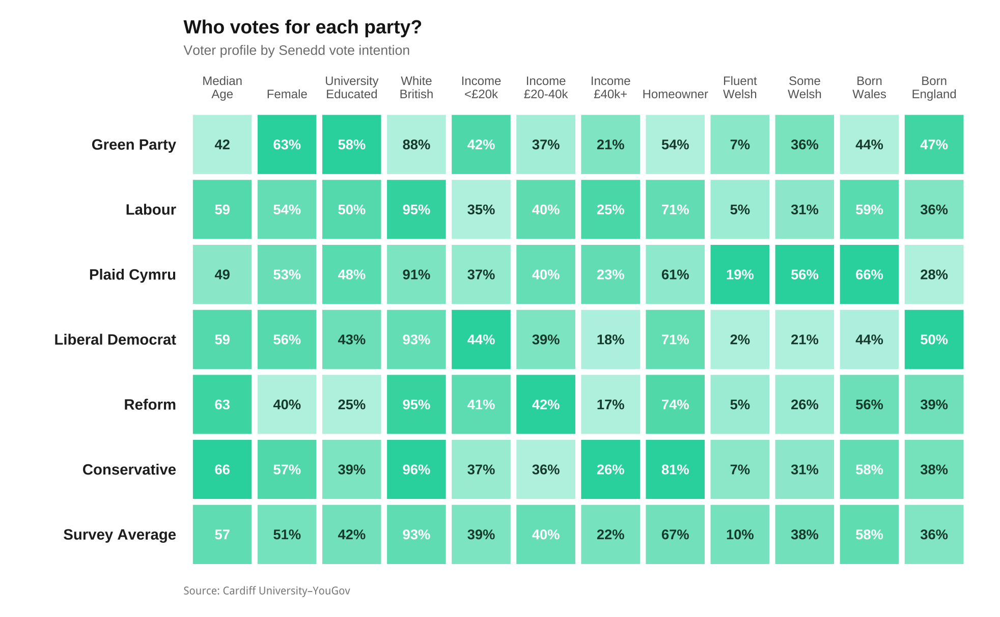
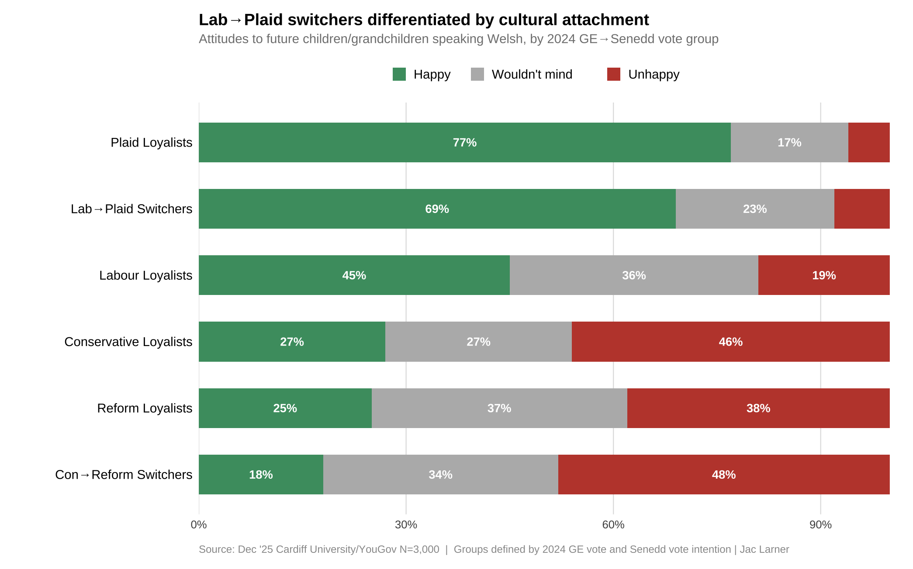
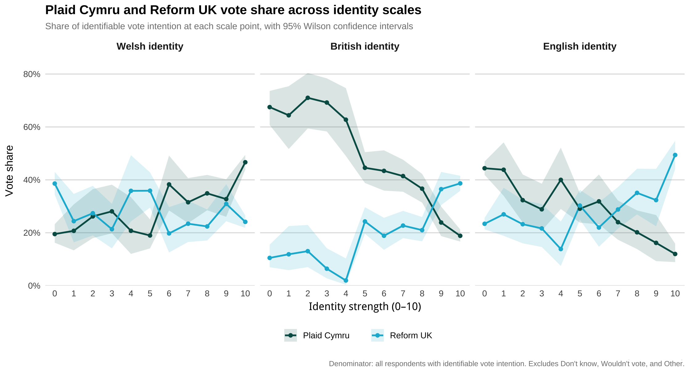
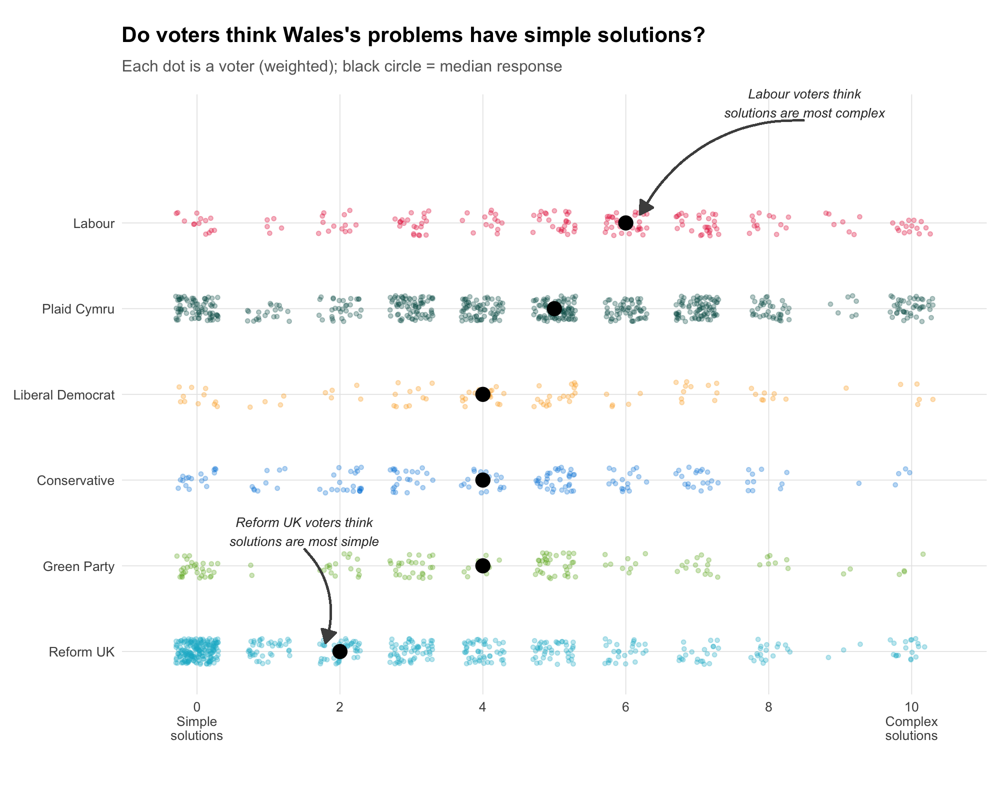
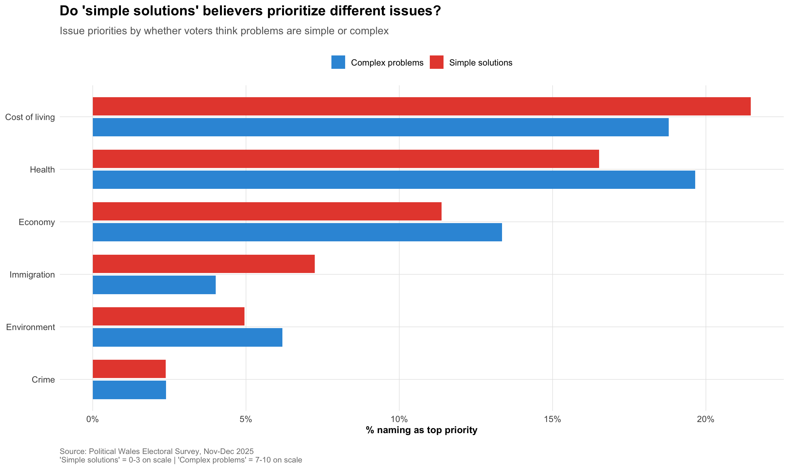
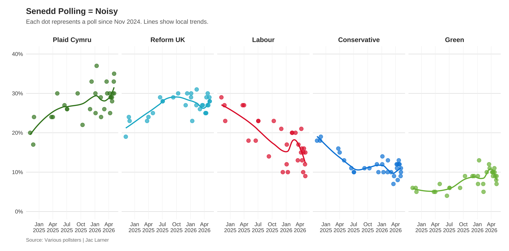

# Early Returns: First Thoughts & Reflections on Senedd 2026 Election

Just over two weeks since the Senedd election have passed and here I share some reflections and early analysis to pull out a few points I've been thinking about. What follows is an attempt to draw together four threads: what the bloc structure of Welsh politics now looks like after the election, what role cultural attachment and national identity played in structuring the result, what the attitudinal landscape might mean for the Senedd term ahead, and an afterthought on polling. It draws on polling data, and large scale survey data collected by YouGov and Cardiff University in December 2025 and in the last 3 weeks of the election campaign.

---

## 1. The Bloc Structure: Consolidation Confirmed

The most important structural feature of the 2026 result is one that has been largely accepted among political scientists in the UK for several years now but has been pretty firmly resisted by parties. This is the idea of parties that electoral politics is now structured around blocs of parties. This is not a novel idea at all: Northern Irish politics long been understood as [operating through blocs of parties](https://www.cambridge.org/core/journals/government-and-opposition/article/evolution-of-party-policy-and-cleavage-voting-under-powersharing-in-northern-ireland/5E83F5E02F0AD6AA6AB3088C1F57E7E5), and the idea of blocs in Welsh politics is [not new](https://orca.cardiff.ac.uk/id/eprint/133816/1/2020larnerjmphd%20%281%29.pdf). In Wales parties can (roughly!) be grouped into two broad coalitions: a Welsh-progressive-Remain bloc, comprising Labour, Plaid Cymru, the Liberal Democrats, and the Greens; and a British-conservative-Leave bloc, comprising Reform UK (and its predeccsor parties) and the Conservatives, and others. Tracking these blocs across Senedd, Westminster, and European Parliament elections from 1999 to 2026 reveals a long-run trajectory in which the right-wing bloc has grown from around 17% in 1999 to roughly 40% in 2026, while the left-progressive bloc has contracted from over 80% to around 58%. The 17.6 percentage point gap between them in 2026 is the narrowest in a devolved election.

*Figure 1: Welsh/Prog/Remain and Brit/Con/Leave bloc vote shares in Wales, 1999–2026, across Senedd, Westminster, and European Parliament elections.*

But what the election also confirmed — and what the voter flow data makes explicit — is that the movement *within* those blocs has been much more dramatic than the movement *between* them. The Sankey diagram of voter flows from 2021 to 2026 tells a story of consolidation rather than conversion. Fifty-six percent of 2021 Conservative voters moved to Reform; Forty percent of 2021 Labour voters moved to Plaid Cymru. The cross-bloc flow that does exist — about 12% of 2021 Labour voters moved to Reform — is real, but it is modest relative to the within-bloc reshuffling.

*Figure 2: Voter flows between 2021 Senedd and 2026 Senedd. Width of flows proportional to estimated number of voters. Source: Cardiff University/YouGov N=3,605.*

This matters because it suggests that the underlying political geography of Wales has not fundamentally changed. The two-bloc structure has become more legible, not because new voters have been won over from the other side, but because the smaller parties within each bloc have haemorrhaged voters to the dominant party of that bloc. The vote share change heatmap makes this geography concrete. Reform gained between 14 and 31 percentage points in every constituency; Plaid gained about 20 points; Labour lost between 12 and 34 points; the Conservatives lost between 4 and 22 points. The symmetry of the collapse is striking. Wherever Labour was strong in 2021, it lost the most ground in 2026. Wherever the Conservatives were strong, Reform gained most dramatically.

*Figure 3: Percentage-point change in vote share by constituency, 2021–2026. Constituencies sorted by Labour swing.*

---

## 2. Cultural Attachment and National Identity Still Structure the Vote

More than 40 years ago Denis Balsom, Peter Madgwick and Denis van Mechelen wrote a foundational work of Welsh political science: [The Red and the Green: Patterns of Partisan Choice in Wales](https://www.jstor.org/stable/193853). They argued that Welsh political behaviour was  was sturctured not only by social class (as was thought to be case in England) but *also* by national identity (described variously Welsh national identity or 'ethnic sentiment'). The two intersected to create three Wales': British Wales, Welsh Wales, and when also intersecting with language, Y Fro Gymraeg. In the paper they introduced a cultural attachment scale as a measure of the 'depth' of welsh national identity. The scale was [flawed as a measure](https://www.sciencedirect.com/science/article/abs/pii/S0261379412001060) as it essentially only captured attitudes to Welsh language, but the underpinning idea was nevertheless a good one. Welsh language remains a core demographic predictor of vote choice in Wales, as shown in the demographic heatmap below (shout out to James Breckwoldt who made these all the time for us and now I also use them).

*Figure 4: Tilemap of demographics and vote intention in pre-election data.*

Yet as Balsom et al made clear it isnt just the ability to speak Welsh that is important but a feeling of attachment towards it. Four decades on, attitudes to Welsh-language transmission — whether respondents would be happy, would not mind, or would be unhappy for their children or grandchildren to speak Welsh — still differentiates between groups of voters. In the run up to the election Plaid Cymru loyalists were unsurprisingly the most culturally attached to the language, with 77% expressing positive feelings about Welsh-language transmission. Lab-to-Plaid switchers are only slightly less so, at 69%. Labour loyalists (2024 and 2026 voters) drop to 45%. The switchers, in other words, are not culturally marginal Labour voters who have drifted towards Plaid for purely tactical reasons. They look culturally like a softer version of existing Plaid supporters making the switch the Plaid much easier, which is consistent with a consolidation story rather than a realignment story.

The mirror image holds on the right. Conservative-to-Reform switchers are the most culturally hostile to Welsh-language transmission, with 48% expressing unhappiness — higher than Reform loyalists at 38%. The switchers are, if anything, to the cultural right of the party they have joined in terms of language attitudes. This is a different kind of consolidation dynamic: it suggests that the cultural pressures driving people from the Conservatives to Reform are more intense than the cultural pressures holding people within Reform.

*Figure 5: Attitudes to future children/grandchildren speaking Welsh, by 2024 GE → 2026 Senedd vote group. Source: Cardiff University/YouGov, Dec 2025, N=2,500.*

As ever in Wales, plain national identity remains a crucial lens to understand electoral politics, even as the electoral link between social class and party support has eroded considerably. As Figure 9 shows, what matters most here is *not* feeling particularly strongly Welsh (Plaid have a significant advantage over Reform but Reform still do well among those with strong Welsh identities). Rather it is the *absence* of British identity which does the best job of differentiating between the two main parites. Here Plaid has a very clear advantge over Reform among all voters who gave a score of less than 9 out of 10 for their Britishness. Among those who identify as English — a distinct and important group in the Welsh context — Reform performs increasingly well, particularly at high levels of English identity strength.

*Figure 6: Plaid Cymru and Reform UK vote share across identity scales, with 95% Wilson confidence intervals. Source: PWES / Cardiff University–YouGov.*

---

## 3. Looking Forward: Do Voters Think Problems Are Hard?

A final point I have been thinking about is how voters understand the issues and problems they identify in terms of their ability to be solved by politicians. This is something that extends well beyond the 2026 Senedd election but will, I think, have implications for any governing incumbents going forward. In December 2025, we asked survey respondents whether they thought the issues facing the country had straightforward solitions, or whether they were too complex for simple soultions (on a 0-10 scale). The distribution of responses across parties shown in Figure 9 is, I think, among the most politically informative data points we've collected recently.

Reform UK voters cluster heavily at the low end of the scale. Their median response is around two: problems have simple solutions. Labour voters sit at the other end, with a median around six. Plaid Cymru and the Liberal Democrats are also much closer to thinking that problems are complext. 

*Figure 7: Do voters think Wales's problems have simple solutions? Each dot is a voter (weighted); black circle = median response. Source: ITV Cymru Wales Jan 2026 poll.*

Simple-solutions believers are more likely to name immigration as a top priority and less likely to name health or the economy. Complex-problem believers prioritise health and the economy more heavily, and are less exercised by immigration. The differences are not enormous in absolute terms — cost of living and health dominate for both groups — but the gap on immigration is meaningful given how politically charged the issue has become.

*Figure 8: Issue priorities by 'simple vs complex solutions' position. Source: Political Wales Electoral Survey, Nov–Dec 2025.*

For Plaid Cymru, about to enter government, this creates a structural challenge. Its own voters are broadly in the complex-problems camp. I think this is probably a good thing for Plaid Cymru as their voters understand the obstacles are big so *might* be slightly more patient and understanding of change not arriving rapidly. But it will still need to govern a Wales in which a very large minority of the electorate — the third of voters who backed Reform — believes the problems of everyday life have been made artificially difficult by political failure. That is an attitudinal gap that policy cannot easily bridge, and it will shape the political weather of the Senedd term in ways that are difficult to predict. The question of whether Welsh government can demonstrate it has the ability to solve society's biggest problems to a sceptical electorate, and whether it can do so in a way that is legible to voters with very different priors about what competence should look like, is a central political challenge of the next four years.

---

## 4. Afterthought on the Polls: Sometimes maybe good, sometimes maybe shit

The pre-election polling environment was, to use the technical term, noisy. Across the period from November 2024 to election day, individual polls for Plaid Cymru ranged from the high teens to the high thirties. Labour polls ranged from the mid-twenties to single figures. Figure 1's scatter of polling data makes this graphically obvious: local trend lines do a reasonable job of capturing the direction of travel, but the variance around them is substantial enough that any given poll needed to be treated with real caution. A lot of this was the result of more polls in Wales by more pollsters than ever before. As the election was arguably the first competitive devolved election we've had, and it was understood the result was going to have profound conseuwnces for the Prime Mininster, there was more incentives for companies to enter the Welsh market.  

*Figure 9: Senedd polling trends, Nov 2024–May 2026. Each dot is a poll; lines show local trends.*

On vote share, the final polls were broadly respectable. FindOutNow finished closest to the actual result, with an average error of 1.0 percentage points across the six parties. YouGov came in at 1.3pp, Survation at 2.0pp. The pollsters who struggled tended to overestimate Labour and underestimate Plaid Cymru often as a result of much higher levels of Labour to Reform switching (see MoreinCommon and Beaufort), and one that probably reflects lingering difficulties in modelling the distinctively devolved nature of Welsh vote intention. While these pollsters final polls weren't a million miles off the final result, just 10 days before they still showed substantial variation before rapidly aligning in the closing stages.

We also had Wales' first MRP seat projections. YouGov's MRP correctly called 43 seats for Plaid and 34 for Reform — a genuinely impressive performance. The final More in Common also had the correct number of Reform UK seats but had a substantial underestimate on Plaid seats and too many Labour. While the introduction of more focus and effort on analysing public opinion in Wales is a good thing, the range of polling and these MRP estimates was often confusing. Anecdotally, there were people consulting the constituency-level projections to inform their vote, and depending on which set of estimates chosen people ended up in very differnt places (in the weekend prior to the election I recieved over 300 emails from people I didn't know asking for voting advice and even had colleagues turn up at my office asking for advice). Yet MRP models remain largely opaque: their methodology is proprietary, their assumptions hidden, and the media — let alone the general public — has limited capacity to interrogate or challenge what the model is actually doing. That black-box quality sits uneasily alongside the outsized influence these projections can carry.

A note of transparency is warranted here. As someone who has regularly appeared in broadcast and print media commenting on Welsh electoral politics throughout this period, I cannot claim neutrality in the processes I am describing. Whether through framing, emphasis, or the act of making certain interpretations publicly available, analysts who engage with the media become — however modestly — part of the story they are telling. I have tried to be alert to this throughout, but the reader should weigh it accordingly.
