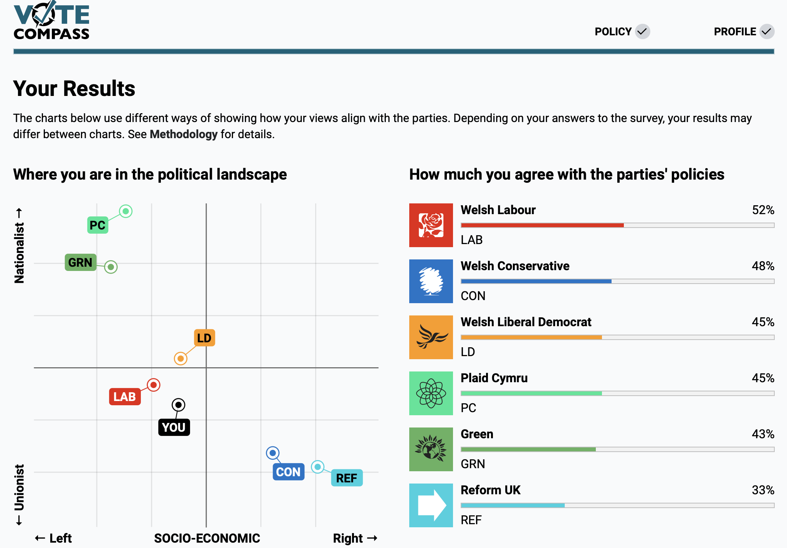
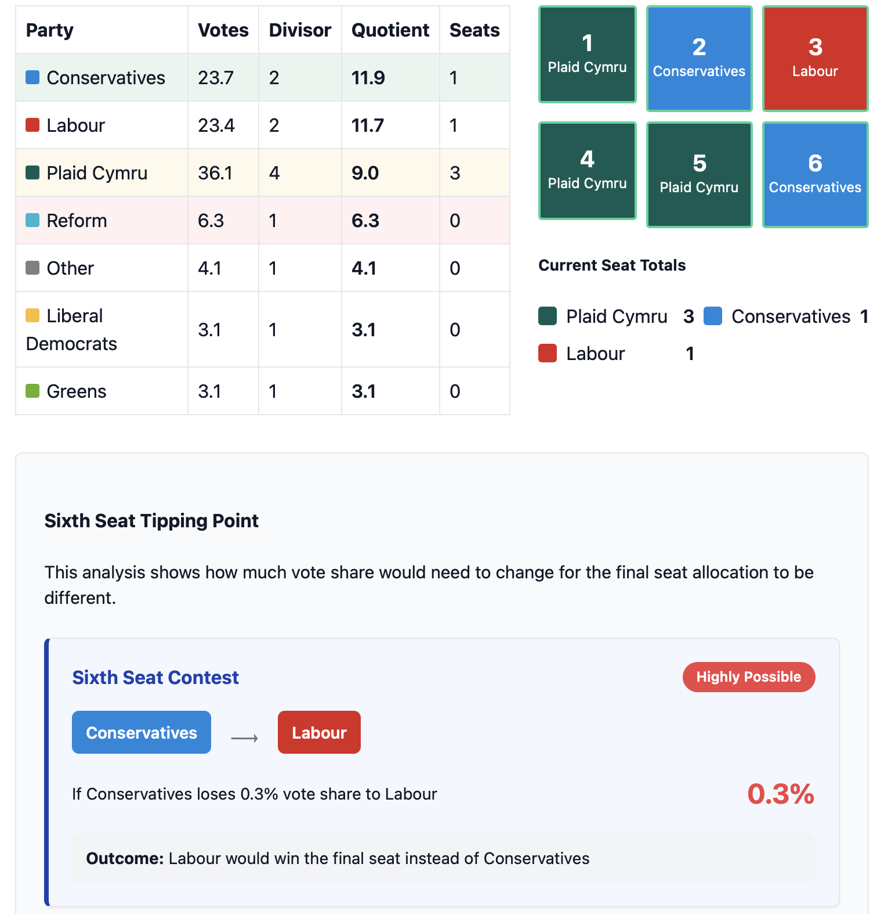

# Media & Engagement

I believe that meaningful public engagement is essential for bridging the gap between academic research and society. Through media appearances, public lectures, and digital tools, I aim to make political analysis accessible and relevant to diverse audiences. I welcome opportunities for collaboration and am always happy to be contacted for media inquiries or speaking engagements.

## Contact Information

For media inquiries or speaking engagements, please contact:

**Email:** larnerJM[AT]cardiff.ac.uk

School of Law and Politics 
Cardiff University

*Providing election analysis on BBC Election Night, July 2024*

## Media Highlights

### National Media

- **BBC Election Night** - Featured political analyst for national coverage
- **Channel 4 News**  - Expert commentary on UK election results
- **Radio 4 News**  - National election analysis
- **The Economist** - Expert contributor on Welsh politics
- **Time Magazine** - Commentary on UK election campaign dynamics
  [Read article](https://time.com/6985435/nigel-farage-uk-election-campaign/)
- **The Guardian** - Featured analysis on Welsh electoral landscape
  [Read article](https://www.theguardian.com/politics/article/2024/may/27/dont-trust-any-of-them-tories-face-wipeout-in-wales-but-labour-is-on-shaky-ground-too)
- **UK in a Changing Europe** - "Welsh Labour and the Travails of Single-Party Dominance" 
  [Read article](https://ukandeu.ac.uk/welsh-labour-and-the-travails-of-single-party-dominance/)

- **BBC Wales** - Multiple appearances across television, radio and digital platforms
- **ITV Wales** - Regular contributor to news programs and election coverage
- **BBC Walescast** - Recurring political analyst
- **Western Mail** - Front page feature (July 2024)
- **BBC Cymru Fyw** - Welsh-language political analysis
  [Read article](https://www.bbc.com/cymrufyw/erthyglau/c74ed8n8xw7o)

## Projects & Digital Tools

  
  

    <h3>Vote Compass UK</h3>
    
Political alignment tool designed to help voters understand where they stand in relation to political parties

    <a href="https://votecompass.uk" class="project-link">Visit Vote Compass UK</a>
  

  
  

    <h3>Senedd Election Explainrer</h3>
    
Educational tool that visualises how the Senedd election system works

    <a href="[https://votecompass.uk](https://jaclarner.github.io/senedd_etholiad_sim/)" class="project-link">Check out the tool</a>
  

## Community Outreach
- **Political Literacy Initiative** (Ongoing) - Work with community groups to improve understanding of electoral systems
- **Youth Political Engagement Program** (2024) - Workshops designed specifically for first-time voters

