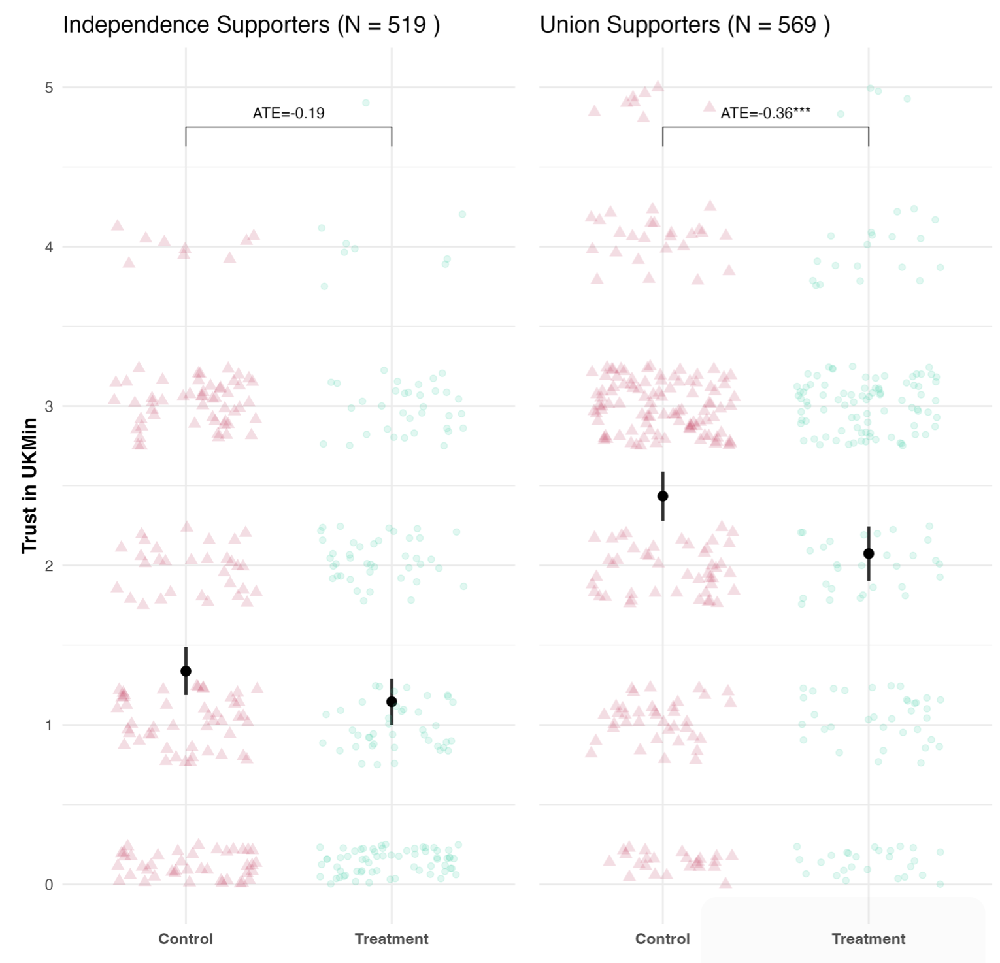
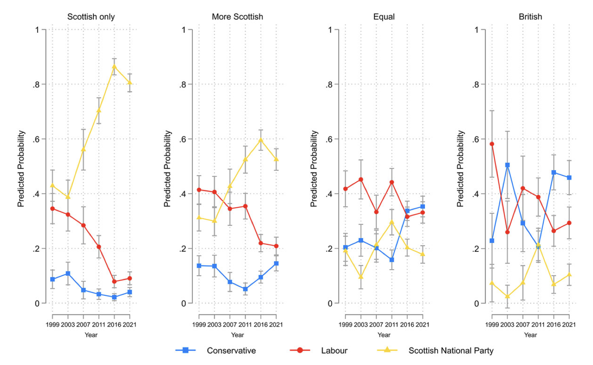
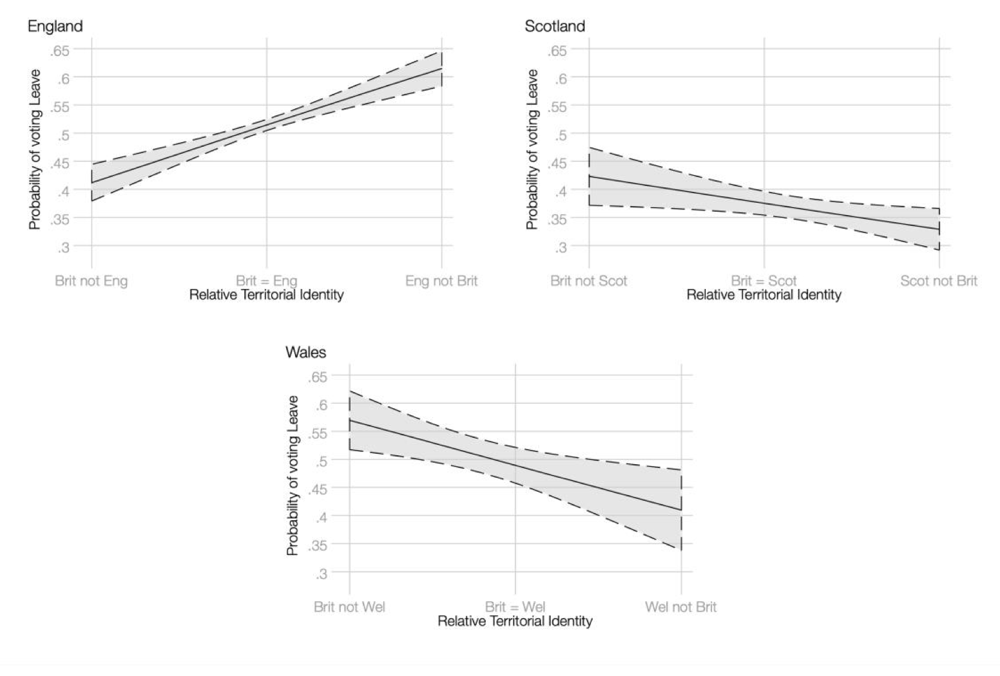

---
title: "Research"
date: 2024-10
subtitle: "Publications, Working Papers, and Works in Progress"
description: "Publications, Working Papers, and Works in Progress"
url: /research
author: Jac M. Larner
email: larnerJM@cardiff.ac.uk
urlcolor: blue

--- 

### Publications, Working Papers, and Works in Progress

----

#### Research Overview
> 
 
  
I conduct research in public opinion, political psychology, and political behavior in the United Kingdom and other advanced democracies. My work examines how identities and values shape political attitudes and electoral choices across three interconnected research streams: National Identity and Electoral Behaviour, Disability and Political Psychology, and Candidate Authenticity.

 

----

# National Identity and Electoral Behaviour

As an Investigator with the Welsh and Scottish Election Studies, I investigate how national identity interacts with other social identities and value systems to influence voting behavior and policy preferences. This work provides insights into the dynamics of multi-level governance and the political consequences of devolution in the UK.

- **Political Scandals and Vertical Contagion in Multilevel Systems**  
  *British Journal of Political Science*, (Forthcoming). With Rob Jonns, Ailsa Henderson, Fraser McMillan and Christopher Carman.   

[Paper](https://orca.cardiff.ac.uk/id/eprint/175327/1/Political_Scandals_and_Vertical_contagion__SUBMITTED_-2.pdf) | [Supplementary Materials](https://orca.cardiff.ac.uk/id/eprint/175327/2/Supplementary_materials.pdf)  
  

  
Abstract

  
 Can a scandal in one political sphere tarnish—or unexpectedly polish—the reputation of leaders and
politicians in another? This study investigates the impact of political scandals in multi-level political systems
and explores three possibilities: *contagion*, where trust erodes across all political levels; *containment*, where
evaluations are limited to the specific institutions involved; and *contrast*, where actors at other levels appear
more trustworthy in comparison. This paper presents the first experimental test of vertical contagion,
containment, and contrast effects following real-world scandals in UK and Scottish politics: Partygate and
Campervangate. We find weak evidence of contagion in the Scottish-level ‘Campervangate’ scandal, al-
though trust reductions were generally small and often not statistically significant. However, the ‘Partygate’
scandal reveals a distinct contrast effect: trust decreased in UK political actors but increased at the Scottish
level. These results suggest that scandals in multi-level polities can influence evaluations of otherwise
‘innocent’ political actors with troubling consequences for democratic accountability mechanisms. 
 

  ##### Figure 3: Effect of treatment on trust in UK Ministers to behave ethically in their job interacted with support for independence.

  

  

----

- **Diverging electoral fortunes in Scotland and Wales: national identities, national interests, and voting behavior**  
  *Regional & Federal Studies*, (2022) with James Griffiths, Richard Wyn Jones, Ed Gareth Poole, Ailsa Hendersn and Fraser McMillan.   

[Paper](https://orca.cardiff.ac.uk/id/eprint/160448/8/Diverging%20electoral%20fortunes%20in%20Scotland%20and%20Wales%20national%20identities%20national%20interests%20and%20voting%20behavior.pdf)  
  

  
Abstract

  
 Despite an extraordinary degree of political turbulence in the UK, the 2021 Scottish and Welsh election results were remarkably similar to those recorded at the previous elections in 2016. While this period spanned the 2016 EU referendum, Britain’s exit from the EU, and the coronavirus pandemic, these upheavals appear to have had little impact on devolved election results. From a comparative perspective, however, such continuity only underlines the extent to which these nations’ political trajectories have diverged since the establishment of devolution in 1999. Using individual-level survey data from twelve election studies over two decades, we show how changing patterns in the relationship between national identity and party support have driven these di ering trajectories. In doing so, we provide the first comparative analysis of voting over time in both countries. Additionally, we show how national identity helps to sustain single-party dominance in Scotland and Wales. 
 

  ##### Figure 2: Predicted probability of voting for a party in 1999–2021 in Scotland, using a multinomial logistic regression model.

  

  

----

- **Making the Case for More Politicians: A Survey Experiment to Investigate Public Attitudes to an Expanded Welsh Parliament**  
  *Parliamentary Affairs*, (2024) with James Griffiths, Richard Wyn Jones and Ed Gareth Poole.   

[Paper]((https://academic.oup.com/pa/article/77/2/285/7097961)) 
  

  
Abstract

  
 In 2022, the Welsh Government announced plans to increase the size of the Welsh Parliament/Senedd Cymru, a culmination of two decades of elite-level argument over whether more members should parallel the institution’s growing suite of legislative and fiscal powers. While an expanded legislature may improve the Senedd’s capacity to scrutinise the executive, opposition has focused on increased costs that detract from core public spending. Using a novel survey experiment conducted in the 2021 Welsh Election Study, we assess public attitudes and find that support for expanding the Senedd is limited to those with a strong Welsh-only identity and pro-autonomy preferences. Although appeals to holding the executive to account do not broaden this base of support, a framing that the Senedd should be comparable in size to legislatures in Scotland and Northern Ireland does have a positive effect on voters with more median constitutional preferences. 
 
  

----

- **Incumbency and Identity: The 2021 Senedd Election**  
  *Parliamentary Affairs*, (2024) with Richard Wyn Jones, Ed Gareth Poole, Paula Surridge and Daniel Wincott.   

[Paper](https://academic.oup.com/pa/article/76/4/857/6583263) 
  

  
Abstract

  
 Taking place amid a global pandemic, the 2021 Senedd Election saw Welsh Labour returned as the largest party at the sixth consecutive occasion since the institution’s founding in 1999. Results for opposition parties were mixed: the Conservatives achieved their highest ever vote share but their seat tally fell short of pre-election expectations, and Plaid Cymru again made little progress. Using data from the 2021 Welsh Election Study, we explore the election campaign and results, and offer a first analysis of vote choice. We find that Labour not only benefitted from incumbency advantages drawn from voters’ approval of the Welsh Government’s handling of the pandemic, but through its use of symbols, branding and messaging, the party continues to remain attuned to a national identity position that broadly aligns with that of the electorate as a whole. 
 
  

----

- **Analysing vote choice in a multi-national state: national identity and territorial differentiation in the 2016 Brexit vote**  
  *Regional Studies*, (2021) with Ailsa Henderson, Richard Wyn Jones, Ed Gareth Poole, Daniel Wincott and Charlie Jeffrey.   

[Paper](https://orca.cardiff.ac.uk/id/eprint/106262/1/Regional%20Studies%20Post%20Print%20Aug%202020.pdf) 
  

  
Abstract

  
 Striking territorial variations in the 2016 Brexit referendum are neglected in the explanatory literature, a gap our analysis of British Election Study helps to fill. Rather than modelling Britain as one political system, we present parallel models for England, Scotland and Wales. Typical in other multi-national states, this approach is innovative for ‘British politics’. To analyse complex multi-level national identities, we develop a Relative Territorial Identity (RTI) measure. Substantively, RTI predicts Brexit vote-choice. Since voters who prioritise English identity tended to vote Leave, while the obverse was true in Wales and Scotland, RTI helps to explain territorial differentiation. 
 

##### Figure 5. Marginal Effect of RTI on Probability of Voting Leave (95% CIs)

  

  

----

# Disability and Political Psychology

I examine how disability status shapes political identity formation, policy attitudes, and support for redistribution. This research challenges conventional assumptions about disability politics by demonstrating how perceptions of deservingness condition public support for welfare programs, even for stereotypically "deserving" groups like people with disabilities.

- **Responsibility for Impairment Shapes the Perceived Deservingness of Welfare Recipients with Disabilities**
  *Political Psychology*, (2024), 00, 1–24. With Joshua Thorp.   
  [Paper](https://orca.cardiff.ac.uk/id/eprint/166755/4/Political%20Psychology%20-%202024%20-%20Thorp%20-%20Responsibility%20for%20impairment%20shapes%20the%20perceived%20deservingness%20of%20welfare%20claimants.pdf) | [Registration](https://aspredicted.org/blind.php?x=iz9iv8)

  

  
Abstract

  
 When do people support government assistance for people with disabilities? Disability welfare programs account for large shares of national welfare budgets, but little is known about public attitudes toward disabled welfare claimants. Drawing on psychological research in stereotype content, we argue that attitudes toward welfare for people with dis- abilities are likely to be more conditional than     previously acknowledged. In two nationally representative, preregistered survey experiments in Wales (N = 3393) and Scotland (N = 1707), we ask respondents to evaluate the deservingness of a fictitious disabled claimant to government assistance. We manipulate the claimant's outgroup status and the manner in which they acquired their impairment. We find that disabled claimants perceived as even somewhat responsible for their impairments are considered substantially less deserving of government assistance than those perceived not responsible, even when their needs for assistance are identical. Contrary to expectations, we find relatively modest and inconsistent outgroup penalties in perceived deservingness. Finally, we find large heterogeneous treatment effects among respondents holding to more authoritarian social values. These results challenge conventional wisdom regarding the universality of support for disability welfare and help explain why voters may not be inclined to punish politicians who propose cuts to programs for even stereotypically high-deserving groups. 

    ##### Figure 1: Main Effects by Treatment Condition

     

  

----

- **Vulnerability Appeals in the COVID-19 Pandemic: Insights from a National Survey Experiment** 
  *The Journal of Experimental Political Science* (2024), 00, 1-16. With Joshua Thorp.  
  [Paper](https://www.cambridge.org/core/services/aop-cambridge-core/content/view/B517E5BF27E9BC622C3E110C3E560727/S2052263024000149a.pdf/vulnerability-appeals-in-the-covid-19-pandemic-insights-from-a-national-survey-experiment.pdf) | [Registration](https://aspredicted.org/j9p69.pdf)

  

  
Abstract

  
This study explores the impact of vulnerability appeals during the COVID-19 pandemic using a nationally representative, pre-registered survey experiment (N=4,087) conducted in mid-2021. We explore whether providing citizens with information about the vulnerability of ethnic minority and disabled citizens to COVID-19 fosters empathy and increased support for behavioural restrictions. We observe minimal statistically significant or substantive effects, although the presence of subtle effects cannot be entirely ruled out. We identify some limited indications that individuals with disabilities exhibit increased support for restrictions when exposed to information about the vulnerability of disabled people to COVID-19, but these effects are inconsistent. Therefore, our findings provide limited evidence to confirm or rule out that using vulnerability appeals alone is effective for influencing public attitudes toward behavioural restrictions. The findings point toward avenues for future research, including a closer examination of heterogeneous responses to public health messaging among population subgroups. 

    ##### Figure 2: Timing of Experiment in the COVID-19 Pandemic

     

  
  

----

- **Disability Stereotypes and Redistribution in the United States** (with Joshua Thorp, *in progress*)  
  [Pre-Analysis Plan](https://www.dropbox.com/scl/fi/pnzgeoehsscme4iegwn4o/Disability_Stereotypes_PAP.pdfrlkey=d2yo7hef1rkbgcr2tha3ybhto&dl=0) | [Registration](https://osf.io/e7r2q)

  

  
Abstract

  
 In multiple studies across time and in differing contexts, opposition to state welfare has been linked to beliefs on the demographic composition of welfare recipients. Particular, and almost exclusive, attention has been paid to the share of groups stereotyped as ’undeserving’, namely people from minority ethnic backgrounds and immigrants. In this paper, we test whether eliciting associations between welfare and disabled people - a group frequently stereotyped as highly deserving - increases support for welfare. Using a nationally representative survey experiment conducted in the United States, we employ random assignment to different treatments aimed at providing distinct signals regarding the proportion of welfare recipients who are disabled. Our analysis encompasses both attitudinal shifts and behavioral responses elicited by these treatments. 

  
  

----

- **Estimating the Causal Effect of Acquisition of Disability on Political Ideology in the United Kingdom** (with Joshua Thorp, *in progress*)

  

  
Abstract

  
 Ageing populations across the developed world have resulted in larger shares of national populations spending more years of life with disabilities and chronic health conditions (Carpenter 2012). How does the acquisition of such conditions shape political behavior? This project utilizes original panel data collected as part of the British Election Study (BES) to estimate the causal effect of acquiring a disabling impairment on political partisanship and support for redistribution in the United Kingdom. In doing so, we contribute to ongoing debates regarding the role of disability and chronic health conditions in shaping political attitudes, and present novel evidence on the political consequences of ageing populations.
    
  
  

----

# Candidate Authenticity

Working with colleagues, I have developed new measures to assess perceived candidate authenticity and its influence on voter decision-making. The goal here is to advance our understanding of how non-policy factors affect electoral outcomes in contemporary democracies.

- **The Authentic A*shole: Candidate Consistency, Causality, and the Vote.** 
  *Polity* (2025). with S. Breitenstein, J. Kenny, D. Stiers and M. Lewis-Beck.  
  [Paper](https://www.journals.uchicago.edu/doi/10.1086/734478) | [Registration](https://aspredicted.org/7yt2-wmh2.pdf)

  

  
Abstract

  
Despite politicians’ authenticity being increasingly invoked in public discourse to explain their electoral fortunes, empirical research on the trait in electoral studies remains nascent. Here we advance our knowledge through a vignette survey experiment carried out on a national British sample. Firstly, we demonstrate that respondents are more likely to perceive a hypothetical politician as authentic when that politician resists political pressure in order to maintain a consistency between their stated policy positions and their political actions. This is the case whether respondents agree with their policy position or not. We also show that a candidate being perceived as authentic carries electoral benefits for them. Furthermore, consistency between a politician’s policy position and their actions enhances citizens’ perception of authenticity, consequently increasing the likelihood that they will vote for that politician. This study contributes to understanding authenticity in politics, offering valuable insights into the causal mechanisms of its electoral implications. 

  
  

----

- **Candidate authenticity and the Iowa Caucus** 
  *Electoral Studies* (2021) with John Kenny and Mike Lewis-Beck.  
  [Paper](https://doi.org/10.1016/j.electstud.2021.102390)

  

  
Abstract

  
 Candidate ‘authenticity’ has become a frequent explanation of electoral performance. Yet its study in electoral research has been largely neglected. Building on recent work, we test its relationship with candidate support in the 2020 Iowa Democratic Caucus through a survey of likely Caucus goers. The Caucus offers an ideal setting — a contest focused on candidates and their personalities, in a context having far-reaching political implications. We demonstrate that authenticity perceptions played an important role in individual vote intentions. Indeed, for Biden and Buttigieg perceptions of their authenticity were strongly associated with vote intention even when controlling for other established traits. Warren, unlike the others, benefited indirectly, because her authenticity triggered substantial support among female voters. The performance of the authenticity trait, direct and indirect, points to its pivotal potential in the 2020 presidential campaign.
 

  
  

----

- **Candidate Authenticity: ‘To Thine Own Self Be True’** 
  *Political Behavior* (2019). with Dieter Stiers, John Kenny, Mike Lewis-Beck, Sofia Breitentein and Florence Vallée-Dubois.  
  [Paper](https://doi.org/10.1007/s11109-019-09589-y)

  

  
Abstract

  
 In recent electoral contests, political observers and media outlets increasingly report on the level of “authenticity” of political candidates. However, even though this term has become commonplace in political commentary, it has received little attention in empirical electoral research. In this study, we identify the characteristics that we argue make a politician “authentic”. After theoretically discussing the different dimensions of this trait, we propose a survey battery aimed at measuring perceptions of the authenticity of political candidates. Testing our measure using data sets from different countries, we show that the answers to our items load on one latent concept that we call “authenticity”. Furthermore, perceptions of candidate authenticity correlate strongly with evaluations of political parties and leaders, and with vote intention, while they are empirically distinguishable from other traits. We conclude that candidate authenticity is an important trait that should be taken into account by future research.
    
  
  

----

# Other Publications

## Book Chapters

- Larner, J. M. & Wyn Jones, R. (2025) 'Wales' in A. Convery (ed.) [*UK Politics*](https://us.sagepub.com/en-us/nam/uk-politics/book285683#contents), SAGE

- Wyn Jones, R. & Larner, J. M. (2021) [Progressive home rule?](https://onlinelibrary.wiley.com/doi/full/10.1111/newe.12221) *Progressive Review*

- Stirbu, D., Larner, J. M., and McAllister, L. (2018) 'Gender Representation in the 'New' Politics: Approaches to Candidate Selection in UK's Legislatures and Beyond' in Guillermo Cordero and Xavier Coller (eds.) [*Democratizing Candidate Selection: New Methods, Old Receipts?*](https://www.palgrave.com/gp/book/9783319765495) (Palgrave MacMillan) ISBN 978-3-319-76549-5

- Larner, J. M. (2017) 'How democratic and effective is the devolved government in Wales?' in Patrick Dunleavy (eds.) [*The 2017 Audit of UK Democracy*](http://www.democraticaudit.com/wp-content/uploads/2017/11/2017AuditofUKDemocracy.pdf)

## Policy Reports and Technical Papers

- Devine, D., Larner, J., Turnbull-Dugarte, S., Jennings, W. (2021) [*Implementation of a Single Transferable Vote (STV) system for local elections in Wales*](https://gov.wales/implementation-single-transferable-vote-system-local-elections-wales)

- Scully, R., Stirbu, D., Pritchard, H., Davies, N., Larner, J. M. (2018) [*Unpacking Diversity: Barriers and Incentives to Standing for Election to the National Assembly for Wales*](http://sites.cardiff.ac.uk/wgc/files/2018/07/REPORT-Unpacking-Diversity-July-2018.pdf)

- McAllister, L. et al. (2017) [*A Parliament That Works for Wales: The report of the Expert Panel on Assembly Electoral Reform*](https://tinyurl.com/ycmm2y2a) (Provided modelling and statistical analysis)

----
